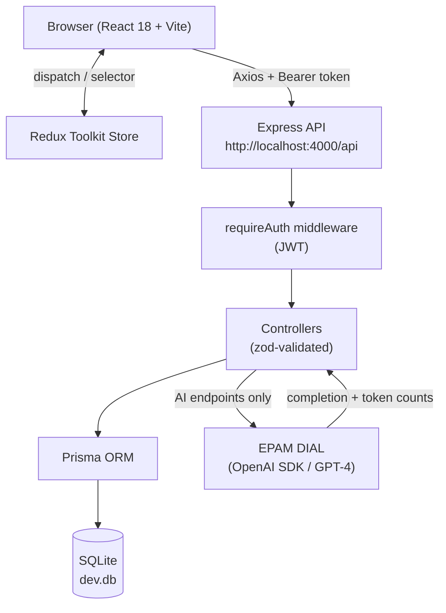
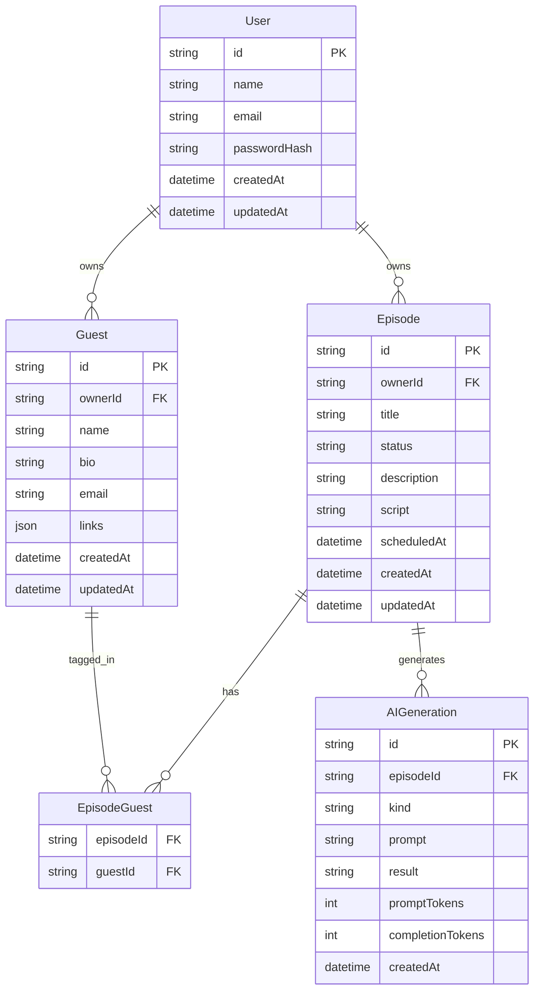
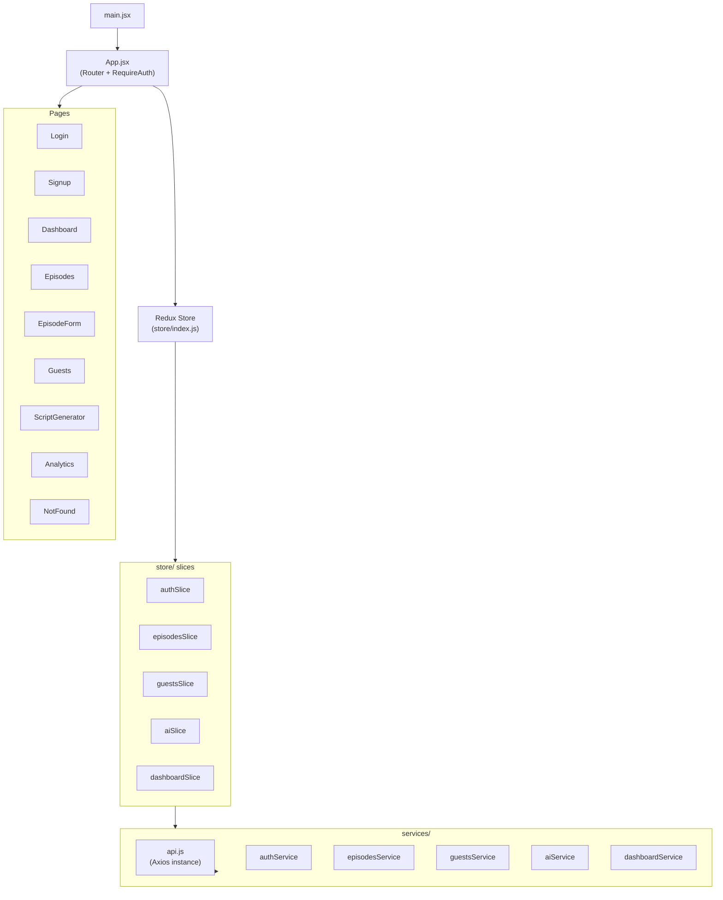
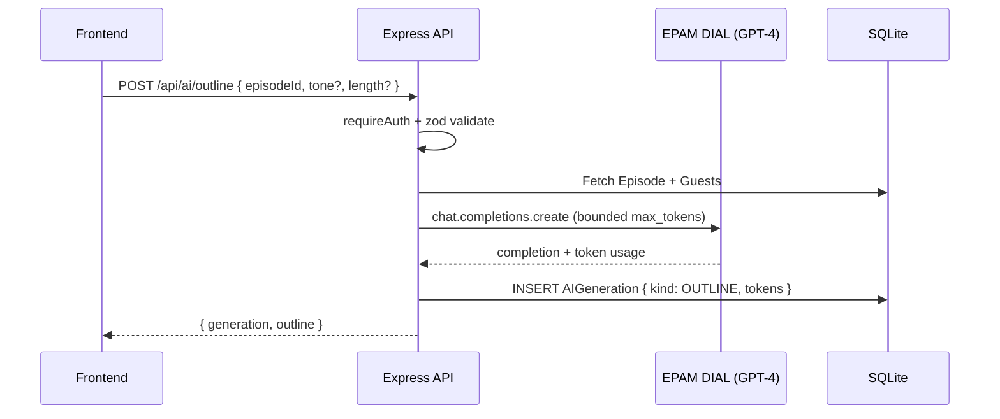
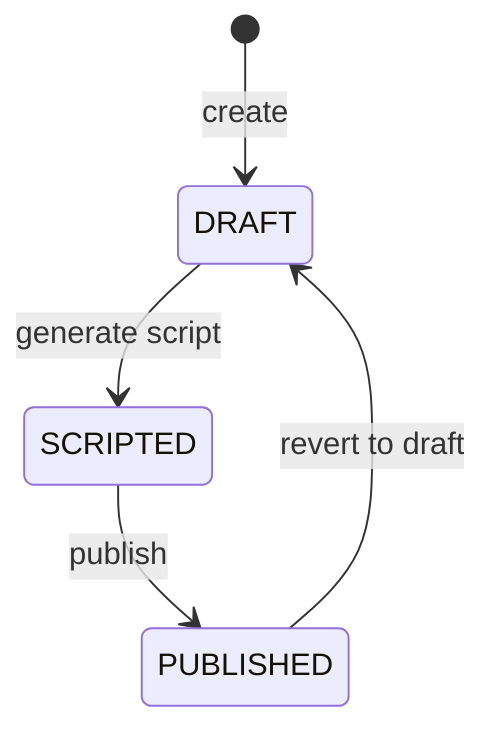

# 🎙️ Podcast Episode Planner

> A full-stack web application that helps podcasters plan episodes end-to-end — manage a guest roster, draft episodes, and leverage an LLM (EPAM DIAL) to generate outlines, scripts, and interview questions.

---

## Table of Contents

- [Overview](#overview)
- [Architecture](#architecture)
  - [High-Level System Diagram](#high-level-system-diagram)
  - [Data Model](#data-model)
  - [Frontend Module Map](#frontend-module-map)
  - [AI Pipeline](#ai-pipeline)
- [Tech Stack](#tech-stack)
- [Setup](#setup)
  - [Prerequisites](#prerequisites)
  - [Environment Variables](#environment-variables)
  - [First-Time Setup](#first-time-setup)
- [Running the App](#running-the-app)
- [API Docs](#api-docs)
  - [Endpoint Overview](#endpoint-overview)
  - [Conventions](#conventions)
- [Usage](#usage)
  - [Authentication](#authentication)
  - [Managing Episodes](#managing-episodes)
  - [Managing Guests](#managing-guests)
  - [AI Generation](#ai-generation)
  - [Dashboard & Analytics](#dashboard--analytics)
- [Testing](#testing)
- [Future Improvements](#future-improvements)

---

## Overview

Podcast Episode Planner is an MVP-grade, local-first application built for podcasters who need a structured workflow from idea to published episode. Key capabilities:

- **Guest Roster** — store bios, social links, and tag guests to episodes
- **Episode Lifecycle** — `DRAFT → SCRIPTED → PUBLISHED` status flow with full CRUD
- **AI Co-pilot** — one-click outline, script, and interview-question generation via EPAM DIAL (GPT-4)
- **Dashboard** — at-a-glance counts by status + recent episode activity

The backend runs on Node/Express with SQLite (via Prisma). The frontend is a React 18 SPA powered by Redux Toolkit and Tailwind CSS. Both servers start with a single `npm run dev` command.

---

## Architecture

### High-Level System Diagram



### Data Model



### Frontend Module Map



### AI Pipeline



---

## Tech Stack

| Layer     | Choice                                                                |
| --------- | --------------------------------------------------------------------- |
| Frontend  | React 18, Vite, Tailwind CSS, Redux Toolkit, React Router v6, Axios  |
| Backend   | Node 20+, Express 4 (CommonJS), Zod, JWT, bcrypt                     |
| Database  | Prisma ORM + SQLite (`file:./dev.db`)                                 |
| AI        | EPAM DIAL via OpenAI SDK (`baseURL` override) · default model `gpt-4`|
| Tests     | Jest + Supertest (BE), Vitest + RTL (FE), Cypress (E2E)              |
| Tooling   | ESLint, Prettier, dotenv                                              |

---

## Setup

### Prerequisites

- Node.js **20+** and npm
- Git

### Environment Variables

**`backend/.env`** (copy from `backend/.env.example`):

| Name            | Required | Default                      | Description                        |
| --------------- | :------: | ---------------------------- | ---------------------------------- |
| `PORT`          | no       | `4000`                       | Express server port                |
| `DATABASE_URL`  | yes      | `file:./dev.db`              | Prisma SQLite connection string    |
| `JWT_SECRET`    | yes      | `change-me`                  | Secret used to sign JWTs           |
| `JWT_EXPIRES_IN`| no       | `7d`                         | JWT expiry duration                |
| `CORS_ORIGIN`   | no       | `http://localhost:5173`      | Allowed CORS origin                |
| `DIAL_API_KEY`  | yes      | _(empty)_                    | EPAM DIAL API key                  |
| `DIAL_BASE_URL` | yes      | _(empty)_                    | EPAM DIAL base URL                 |
| `DIAL_MODEL`    | no       | `gpt-4`                      | Model name passed to DIAL          |

**`frontend/.env`** (copy from `frontend/.env.example`):

| Name                 | Required | Default                       | Description              |
| -------------------- | :------: | ----------------------------- | ------------------------ |
| `VITE_API_BASE_URL`  | yes      | `http://localhost:4000/api`   | Backend API base URL     |

### First-Time Setup

```bash
# 1. Clone
git clone <repo-url> && cd AI-kata

# 2. Backend
cd backend
npm install
cp .env.example .env          # fill in DIAL_API_KEY + DIAL_BASE_URL
npx prisma migrate dev --name init
npm run seed                  # optional: loads demo data

# 3. Frontend (new terminal)
cd ../frontend
npm install
cp .env.example .env
```

---

## Running the App

```bash
# Terminal 1 — backend  (http://localhost:4000)
cd backend && npm run dev

# Terminal 2 — frontend (http://localhost:5173)
cd frontend && npm run dev
```

Health check: `GET http://localhost:4000/health` → `{ "status": "ok" }`

Production build:

```bash
cd frontend && npm run build   # static assets → frontend/dist/
cd backend  && npm start       # NODE_ENV=production
```

---

## API Docs

Full request/response shapes live in [docs/API_CONTRACT.md](docs/API_CONTRACT.md).

### Endpoint Overview

Base URL: `http://localhost:4000/api`

| Method   | Path                        | Auth | Purpose                                  |
| -------- | --------------------------- | :--: | ---------------------------------------- |
| `POST`   | `/auth/register`            | —    | Create user, return JWT                  |
| `POST`   | `/auth/login`               | —    | Authenticate, return JWT                 |
| `GET`    | `/auth/me`                  | ✓    | Current user profile                     |
| `GET`    | `/episodes`                 | ✓    | Paginated list (filter by status)        |
| `POST`   | `/episodes`                 | ✓    | Create episode                           |
| `GET`    | `/episodes/:id`             | ✓    | Episode detail incl. guests + generations|
| `PATCH`  | `/episodes/:id`             | ✓    | Update fields / status                   |
| `DELETE` | `/episodes/:id`             | ✓    | Cascade delete                           |
| `POST`   | `/episodes/:id/guests`      | ✓    | Attach guest `{ guestId }`               |
| `DELETE` | `/episodes/:id/guests/:gid` | ✓    | Detach guest                             |
| `GET`    | `/guests`                   | ✓    | List user's guests                       |
| `POST`   | `/guests`                   | ✓    | Create guest                             |
| `PATCH`  | `/guests/:id`               | ✓    | Update guest                             |
| `DELETE` | `/guests/:id`               | ✓    | Delete guest                             |
| `POST`   | `/ai/outline`               | ✓    | Generate episode outline                 |
| `POST`   | `/ai/script`                | ✓    | Generate + persist full script           |
| `POST`   | `/ai/questions`             | ✓    | Generate interview questions             |
| `GET`    | `/dashboard/summary`        | ✓    | Status counts + recent episodes          |

### Conventions

- **Auth header:** `Authorization: Bearer <jwt>`
- **Success:** raw resource, or `{ data, page, pageSize, total }` for lists
- **Error:** `{ error: { code, message, details? } }`
- **Ownership:** every read/write asserts `ownerId === req.user.id`
- **Validation:** Zod at the controller boundary; extra fields rejected
- **Rate limit:** 100 requests / 15 min per IP on all `/api/*` routes

---

## Usage

### Authentication

1. Navigate to `http://localhost:5173`
2. Click **Sign Up** to create an account, or **Log In** if you already have one
3. Your JWT is stored in Redux state and sent automatically on every API request

### Managing Episodes

- **Dashboard** shows a status summary and recent episodes
- **Episodes list** (`/episodes`) — filter by `DRAFT`, `SCRIPTED`, or `PUBLISHED`
- **New Episode** (`/episodes/new`) — fill title, description, and optionally a scheduled date
- **Edit Episode** — update any field or advance the status through the lifecycle:



### Managing Guests

- **Guests page** (`/guests`) — add, edit, or delete guests from your roster
- Attach guests to an episode from the episode edit form via the **Tag Input** component
- Guest profiles store name, bio, email, and an array of social/web links

### AI Generation

All generation is triggered from the **Script Generator** page (`/script-generator`) or from within an episode:

| Action             | Endpoint             | What you get                                      |
| ------------------ | -------------------- | ------------------------------------------------- |
| Generate Outline   | `POST /ai/outline`   | Structured episode outline (sections + durations) |
| Generate Script    | `POST /ai/script`    | Full narration script saved to the episode        |
| Generate Questions | `POST /ai/questions` | List of interview questions tailored to guests    |

> **Note:** AI calls require valid `DIAL_API_KEY` and `DIAL_BASE_URL` in `backend/.env`.

### Dashboard & Analytics

- `/dashboard` — episode counts by status, recent activity feed
- `/analytics` — deeper episode and guest engagement metrics

---

## Testing

```bash
# Backend — Jest + Supertest
cd backend && npm test

# Frontend — Vitest + React Testing Library
cd frontend && npm test

# E2E — Cypress (requires both servers running)
cd frontend && npm run cypress:run
```

Tests mock DIAL — no network calls are made in CI.

---

## Future Improvements

| Area               | Idea                                                                                      |
| ------------------ | ----------------------------------------------------------------------------------------- |
| **Export**         | One-click PDF/Markdown export of scripts and outlines                                     |
| **Collaboration**  | Multi-user workspaces with role-based access (editor / viewer)                            |
| **Scheduling**     | Calendar view + reminders for scheduled episodes                                          |
| **AI models**      | Swap model per-generation (GPT-4o, Claude 3, etc.) via a user-facing model picker         |
| **Version history**| Track all AI generation versions per episode, with diff view                              |
| **Webhooks**       | Publish notifications to Slack / email when an episode moves to `PUBLISHED`               |
| **Mobile app**     | React Native companion for on-the-go episode drafting                                     |
| **Postgres**       | Migrate from SQLite to Postgres for multi-tenant cloud deployment                         |
| **ADR coverage**   | Document outstanding architectural decisions under `docs/adr/`                            |

---

> Docs are in sync with [backend/src/index.js](backend/src/index.js), [PROJECT.md](PROJECT.md), and [docs/API_CONTRACT.md](docs/API_CONTRACT.md).
